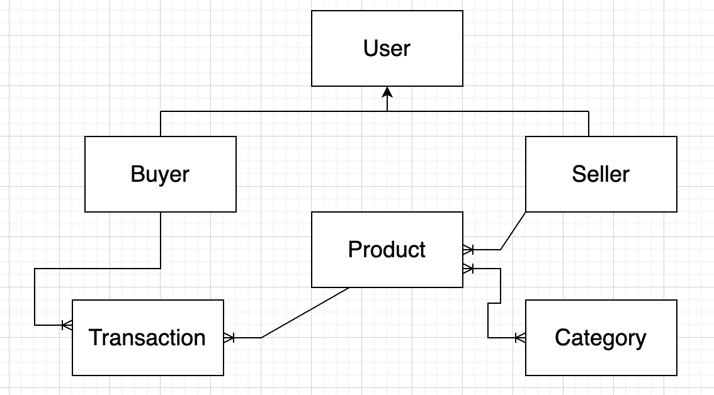
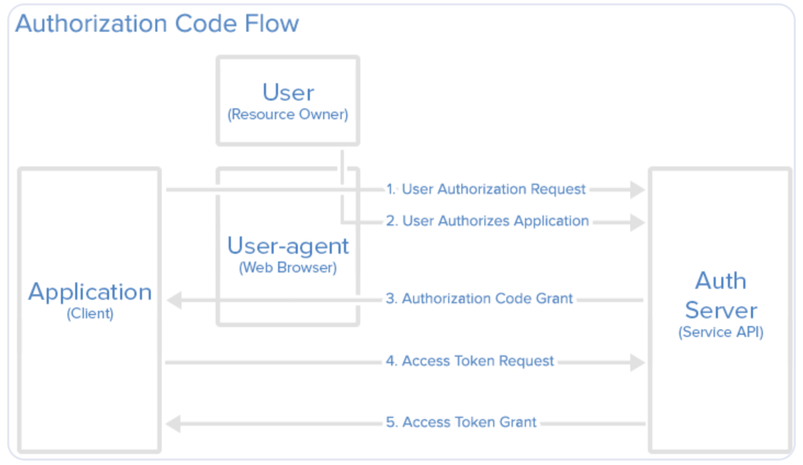

<h1 align="center">
  Ecom API
</h1>

<h4 align="center"> Ecommerce API</h4>

## Contents

* [Set Up Project](#set-up-project)
* [Resources](#resources)
* [Restrictions](#restrictions)
* [User Stories](#user-stories)
* [Buyer Stories](#buyer-stories)
* [Seller Stories](#seller-stories)
* [Transaction Stories](#transaction-stories)
* [Product Stories](#product-stories)
* [Category Stories](#category-stories)

### Set Up Project
1. Run `docker-compose up`
2. Copy environment file `cp .env.example .env`
3. Run db migration and populate db with dummy data `php artisan migrate:refresh --seed`


### Resources
* User
  * Buyer
  * Seller
* Transaction
* Product
* Category

  
### Restrictions
* A buyer or a seller extends from User.
* A buyer can be a seller and vice versa.
* A user can be both buyer and seller.
* A buyer shouldn't be able to buy from himself
* A seller shouldn't be able to sell to himself

### Authentication
* A client should be able to login and register.

### Authorization
* Admin user can access the product(s) of buyer and seller
* Token Authorization Scope:
```
'purchase-product' => 'Create a new transaction for a specific product.',
'manage-products' => 'Create, read, update and delete. (CRUD)',
'manage-account' => 'Read your account data, id, name, email, if verified, and if admin (cannot read password). Modify your account (email and password). Can not delete your account.',
'read-general' => 'Read general information like purchasing categories, you transactions (purchases and sales)'
```
* Creating tokens for client:
```
php artisan passport:client
php artisan passport:client --password
```
* Creating token for registered user.
```
curl --location --request POST 'http://localhost:8000/api/oauth/token' \
--form 'grant_type="password"' \
--form 'client_id="974af286-887f-4235-9324-5ae8fd3573fb"' \
--form 'client_secret="YOiZ9bk4FHMQh6XOjXFO3vuP89D21lMlwg2xRj9k"' \
--form 'username="leon34@example.org"' \
--form 'password="password"'
```
* Creating token for registered user with authorization scope.
```
curl --location --request POST 'http://localhost:8000/api/oauth/token' \
--form 'grant_type="password"' \
--form 'client_id="974d8008-6f51-4a02-84bf-d94dda1e6eae"' \
--form 'client_secret="QR8paLrh3600VRnwXjZhDqkxON2gIdIVNCB8tuSs"' \
--form 'username="leon34@example.org"' \
--form 'password="password"' \
--form 'scope="read-general"'
```
* Perform authorized actions:
For Example:
```
curl --location --request GET 'http://localhost:8000/api/product/1/category' \
--header 'Authorization: Bearer <generated_token>
```


### User Stories
* As a user I want to be able to login and register using an email and a password.
* As a user I want to be able to know if I'm an admin or not.
* As a user I want to be able to verify my account through email after registering.
* Unverified user shouldn't be able to login.

### Buyer Stories
* A buyer can purchase several products through a transaction.
* A buyer can have several transactions.
* A buyer will always have transaction(s)
* A buyer will have the products from transaction(s) - (to avoid n+1 problem, use eager loading)
* A buyer will have the seller(s) of (a) product(s) through transaction(s), only accessible by admin users - (to avoid n+1 problem, use eager loading)
* A buyer will have the categories of (a) product(s) through transaction(s) - (to avoid n+1 problem, use eager loading)

### Seller Stories
* A seller can own many products
* A seller always have product(s)
* A seller will have transaction(s) only from related product(s) that has transaction(s) - (to avoid n+1 problem, use eager loading)
* A seller will have categories only from related product(s) that has categories - (to avoid n+1 problem, use eager loading)
* A seller will have buyer(s) only from related product(s) that has transaction(s) with buyer(s) (caveat: transactions always have buyers), only accessible by admin users - (to avoid n+1 problem, use eager loading)
* A seller will have related product(s) using these authorization rights: `read-general` and `manage-products`
* A seller can only perform CRUD on his/her own product.

### Transaction Stories
* A transaction happens whenever someone buys or sells (a) product(s)
* A category of transaction is the product that's a part of that transaction.
* A seller of transaction is the product that's a part of that transaction.

### Product Stories
* A product can have many Categories.
* A product can have many transaction(s), only accessible by admin users.
* A product can have many transaction(s), only accessible by admin users.
* A product can have many buyer(s), only from (a) transaction(s) with buyer(s) (caveat: transactions always have buyers), only accessible by admin users.
* A product can be deleted and updated on categories.
* Listen on an event whenever product is available and updated.

### Category Stories
* A category can have many Product.
* A category will have product(s) or no product(s)
* A category will have seller(s) from related product(s), only accessible by admin users - (to avoid n+1 problem, use eager loading)
* A category will have transaction(s) only from (a) product(s) that have transaction(s), only accessible by admin users - (to avoid n+1 problem, use eager loading)
* A category will have buyer(s) only from (a) product(s) that have transaction(s) with buyer(s) (caveat: transactions always have buyers), only accessible by admin users - (to avoid n+1 problem, use eager loading)

### Features
* Soft delete to remove items from list but not on the db.
* Pagination on list of items.
* CRUD functionality depending on the specified authorization scope.
* To test email verification, make a test account on mailtrap.io and put the values on .env.
  
Sample Values:
```
MAIL_USERNAME=a6ce17cd72c778222
MAIL_PASSWORD=ecfbe2ef53743e290
```
* Receive a mail when user is created or updated.
* Resources can be sorted and filtered by attribute.
* Sub-resources have links instead of big objects. HATEOAS
* Cache transformed data then make it expire after 50 seconds.
* Input Validation works on transformed data.

## Support

<a href="https://www.buymeacoffee.com/pristineweb" target="_blank"></a>

## License

MIT

---

> GitHub [@william](https://github.com/william251082)

